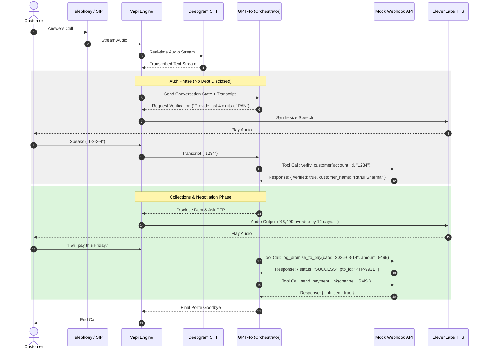
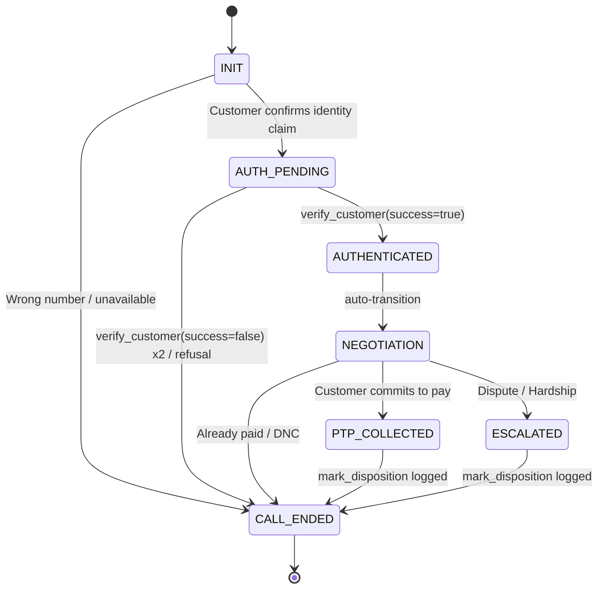

# High-Level Design Document
## Automated Outbound Voice AI Collections Agent — "Maya" (Kapture Finance)

**Version:** 1.0
**Author:** Engineering Team
**Status:** Ready for Build

---

## 1. Overview

Maya is an outbound voice AI agent that calls customers with overdue EMIs, authenticates their identity, discloses the overdue amount only after successful verification, negotiates a resolution (Promise-to-Pay, dispute, hardship, already-paid, or opt-out), and logs a final call disposition. The system is built on Vapi.ai as the orchestration layer, using Deepgram for transcription, GPT-4o as the reasoning/orchestrator LLM, and ElevenLabs/Cartesia for speech synthesis.

This document covers the 8 required engineering sections: pipeline & latency budget, state machine, intents & entities, tool/API specs, auth & data safety, compliance & guardrails, edge case matrix, and observability metrics.

---

## 2. Pipeline & Latency Budget

### 2.1 Architecture Flow

### 2.2 Latency Budget per Hop

| Hop | Component | Target Latency | Notes |
|---|---|---|---|
| 1 | Telephony ingress (SIP/PSTN → Vapi) | ~50 ms | Carrier/network dependent |
| 2 | STT (Deepgram Nova-2, streaming) | ~200 ms | Interim + final transcript |
| 3 | Orchestrator / LLM first byte (GPT-4o) | ~400 ms | Temperature 0.1, short system prompt window, function-calling adds ~50–100ms when triggered |
| 4 | TTS synthesis first audio byte (ElevenLabs/Cartesia) | ~300 ms | Streaming synthesis, not full-utterance wait |
| 5 | Network / jitter buffer overhead | ~200 ms | Round-trip packetization |
| 6 | Tool webhook round-trip (when triggered, e.g. `verify_customer`) | ~150–250 ms (parallel to hop 4 where possible) | Mock server, same-region hosting recommended |
| **Total (steady-state turn)** | | **< 1.2 s** | Excludes tool-call turns, which may add one extra LLM round-trip |

**Design choices to hit budget:**
- Use streaming STT and streaming TTS (not batch) to reduce perceived latency.
- Keep the system prompt lean; avoid re-sending full transcript history on every turn where possible (Vapi manages this internally).
- Host the mock webhook server in the same cloud region as Vapi's default execution region to minimize tool round-trip time.
- Use `gpt-4o-mini` if `gpt-4o` first-byte latency exceeds budget in testing; trade a small quality loss for latency headroom.

---

## 3. Conversation State Machine

### 3.1 States

| State | Description | Entry Condition | Exit Condition |
|---|---|---|---|
| `INIT` | Call connects, greeting plays | Call answered | Customer responds |
| `AUTH_PENDING` | Identity being verified, zero debt disclosure | Customer confirms they are (or represent) the target | `verify_customer` tool returns `verified: true` → `AUTHENTICATED`; repeated failure / wrong person → `CALL_ENDED` |
| `AUTHENTICATED` | Verified; transitional state before disclosure | `verify_customer` returns success | Immediately proceeds to `NEGOTIATION` |
| `NEGOTIATION` | Debt disclosed, intent identified, options discussed | Entered `AUTHENTICATED` | Branch resolves to PTP, dispute, hardship, already-paid, or DNC |
| `PTP_COLLECTED` | Promise-to-pay logged, payment link sent | `log_promise_to_pay` + `send_payment_link` succeed | → `CALL_ENDED` |
| `ESCALATED` | Routed to human agent / grievance desk | Dispute or hardship requiring human handling | → `CALL_ENDED` |
| `CALL_ENDED` | Disposition logged, call terminated | Any terminal branch reached | Terminal state |

### 3.2 Hard Lock Rule

> **Transitions out of `AUTH_PENDING` into `AUTHENTICATED` are strictly locked behind a successful `verify_customer(status: success)` tool response.** The LLM is explicitly instructed (and constrained via prompt + low temperature) never to disclose debt-related terms — "overdue," "loan," "EMI," "amount," "Kapture Finance debt" — while in `INIT` or `AUTH_PENDING`. This is enforced both by prompt instruction and by the tool call being a mandatory gate before any `NEGOTIATION`-state utterance is permitted.

### 3.3 State Diagram

---

## 4. Intents & Entities Table

### 4.1 Intents

| Intent | Trigger Utterance Examples | Resulting Action |
|---|---|---|
| `Confirm_Identity` | "Yes, this is Rahul" / "Speaking" | Move to `AUTH_PENDING` |
| `Promise_To_Pay` | "I'll pay Friday" / "I can pay ₹5000 now" | Move to `PTP_COLLECTED`; call `log_promise_to_pay` |
| `Hardship_Claim` | "I lost my job" / "I can't pay full amount" | Move to `ESCALATED`; call `escalate_to_agent(reason=HARDSHIP_REQUEST)` |
| `Dispute_Debt` | "I don't owe this" / "This isn't my loan" | Move to `ESCALATED`; call `escalate_to_agent(reason=DISPUTE)` |
| `Already_Paid` | "I already paid yesterday" | Call `mark_disposition(status=ALREADY_PAID)` |
| `Request_DNC` | "Stop calling me" / "Remove my number" | Call `mark_disposition(status=DO_NOT_CALL)`; end call immediately |
| `Wrong_Person` | "Wrong number" / "He doesn't live here" | Call `mark_disposition(status=WRONG_PERSON)`; end call |

### 4.2 Entities

| Entity | Type | Format | Example |
|---|---|---|---|
| `PTP_Date` | Date | ISO-8601 (`YYYY-MM-DD`) | `2026-08-21` |
| `PTP_Amount` | Number | Decimal, INR | `8499` |
| `Hardship_Reason` | String | Free text, categorized post-hoc | `"job loss"` |
| `Verification_Code` | String | 4-digit PAN suffix or 4-digit birth year | `"1234"` / `"1995"` |

---

## 5. Tool / API Specifications

All tools are registered in Vapi and point to a single webhook endpoint (`POST /webhook`) on the mock server, dispatched by `message.type === "tool-calls"`.

### 5.1 `verify_customer`
- **Purpose:** Gate for identity verification; must succeed before any debt disclosure.
- **Request:** `{ "account_id": "ACC-88392", "verification_code": "1234" }`
- **Response:** `{ "verified": true, "message": "Identity verified successfully." }`

### 5.2 `log_promise_to_pay`
- **Purpose:** Record PTP commitment.
- **Request:** `{ "account_id": "ACC-88392", "ptp_date": "2026-08-21", "amount": 8499 }`
- **Response:** `{ "success": true, "ptp_id": "PTP-9921", "confirmed_date": "2026-08-21", "amount": 8499 }`

### 5.3 `send_payment_link`
- **Purpose:** Dispatch a payment link via SMS/WhatsApp.
- **Request:** `{ "account_id": "ACC-88392", "channel": "SMS" }`
- **Response:** `{ "success": true, "message": "Payment link sent successfully via SMS to registered mobile number." }`

### 5.4 `escalate_to_agent`
- **Purpose:** Route hardship or dispute cases to a human agent / grievance desk.
- **Request:** `{ "account_id": "ACC-88392", "reason": "DISPUTE" }`
- **Response:** `{ "success": true, "escalation_id": "ESC-4471", "queued": true }`

### 5.5 `mark_disposition`
- **Purpose:** Log final call outcome.
- **Request:** `{ "account_id": "ACC-88392", "status": "PTP_AGREED", "notes": "Customer committed to pay by Friday" }`
- **Response:** `{ "success": true, "disposition_logged": "PTP_AGREED", "timestamp": "2026-08-15T10:22:00Z" }`

Full JSON Schemas are provided in `vapi/tool_definitions.json`.

---

## 6. Auth & Data Safety Protocols

- **PII Masking in Logs:** Customer names are masked in all persisted logs, e.g. `Rahul S****`. Account IDs are logged in full (internal reference only); PAN/DOB verification codes are never logged in plaintext — only a boolean match result is stored.
- **Zero Pre-Auth Disclosure:** The terms "overdue," "loan," "EMI," "amount," and "Kapture Finance debt" are prohibited from the agent's speech in `INIT` and `AUTH_PENDING` states. This is enforced by explicit system prompt instruction plus a low temperature (0.1) setting to reduce prompt-deviation risk.
- **Data Retention:** Call transcripts and disposition records are retained per the client's data retention policy (recommend 90 days for QA sampling, then anonymized archival).
- **Transport Security:** All webhook traffic between Vapi and the mock server travels over HTTPS (via ngrok tunnel in dev, TLS-terminated load balancer in production).
- **Least-Privilege Tooling:** The LLM only has access to the five defined tools — no generic database or file-system access — limiting blast radius of any prompt injection attempt from the customer's speech.

---

## 7. Compliance & Guardrails

- **RBI Fair Practices Code Adherence:**
  - Calling window strictly enforced: 08:00–19:00 local time (calls outside this window are not dialed by the outbound scheduler).
  - No debt disclosure to unverified/third parties.
  - Instant Do-Not-Call (DNC) honoring — logged and call terminated within the same turn the request is made.
  - No harassment: agent gives at most one warning to an abusive caller before a soft hangup (see Edge Cases).
- **Hallucination Prevention:**
  - Agent is prohibited from offering unauthorized settlement waivers greater than 10% of the outstanding amount; any waiver request beyond that threshold is escalated to `escalate_to_agent`, never approved autonomously.
  - Agent cannot fabricate account details, payment references, or dates — all figures must originate from the account context block or a tool response, never invented.
  - Low temperature (0.1) reduces creative drift from the compliance script.
- **Consent & Tone:** Calm, respectful, non-threatening language only; no legal threats, no repeated calling pressure within a single session.

---

## 8. Edge Cases Matrix

| Scenario | Trigger | Agent Behavior | Disposition |
|---|---|---|---|
| Abusive user | Profanity / hostile language | One calm warning ("I understand you're frustrated, but I'll need to end the call if this continues") → soft hangup if repeated | `ABUSIVE_TERMINATED` |
| Silent user / voicemail | No speech detected for N seconds | Re-prompt twice ("Hello, are you still there?") → hangup if no response | `NO_INPUT` |
| Mid-call language switch | Customer switches English ↔ Hindi | Agent detects language shift via STT and switches response language/register (Hinglish fallback), preserving state and entity extraction | State preserved, no disposition change |
| Wrong number | "You have the wrong number" | Ask if target customer is reachable at this number at all; if not, log and end | `WRONG_NUMBER` |
| Third-party pickup (spouse/family) | Someone other than target answers, target unavailable | Do not disclose any debt info; ask when target will be available; end politely | `THIRD_PARTY_NO_DISCLOSURE` |
| Repeated failed verification | 2 incorrect verification attempts | Do not disclose debt; offer to call back later or route to human verification | `AUTH_FAILED` |
| Dispute of debt validity | "This isn't my loan" | Escalate to grievance officer, no argument from agent | `DISPUTED` (via `escalate_to_agent`) |
| Partial hardship payment offer | Customer offers partial amount only | Accept and log as PTP with partial amount, or escalate if customer requests waiver >10% | `PTP_AGREED` (partial) or `HARDSHIP_ESCALATED` |
| Call drops mid-negotiation | Network/telephony failure | Log last known state and partial disposition (`INCOMPLETE`) for callback scheduling | `NO_RESPONSE` / `INCOMPLETE` |

---

## 9. Observability Metrics

| Metric | Definition | Target / Use |
|---|---|---|
| **Containment Rate** | % of calls resolved by Maya without human escalation | Track weekly; flag drops as prompt/tool regressions |
| **PTP Rate** | % of calls ending in a valid, logged promise-to-pay | Primary business KPI for collections effectiveness |
| **First Call Resolution (FCR)** | % of calls ending in *any* valid, complete disposition (not `NO_RESPONSE`/`INCOMPLETE`) | Measures conversational robustness |
| **Auth Success Rate** | % of `AUTH_PENDING` attempts resulting in successful verification | Distinguishes genuine failures from fraud/wrong-number noise |
| **Average Latency per Turn** | Mean round-trip time per conversational turn | Should stay under 1.2s budget; alert if p95 exceeds 1.8s |
| **Escalation Rate** | % of calls routed to `ESCALATED` state | Monitor for spikes indicating prompt confusion or genuine dispute surges |
| **Compliance Violation Rate** | % of calls where debt terms were used pre-authentication (via automated transcript scan) | Target: 0%. Any non-zero value is a P0 bug |
| **DNC Compliance Latency** | Time between DNC request and disposition logging | Target: same-turn (< 1 conversational turn) |

---

## 10. Future Enhancements

- Multi-language production support beyond English/Hindi (regional languages per RBI mandate).
- Sentiment analysis layer for real-time escalation triggers on rising customer distress.
- A/B testing framework for negotiation scripts to optimize PTP rate without compromising compliance.
- Integration with a real CRM/loan management system replacing the mock webhook server.
- Automated post-call QA scoring against the compliance & tone rubric.
